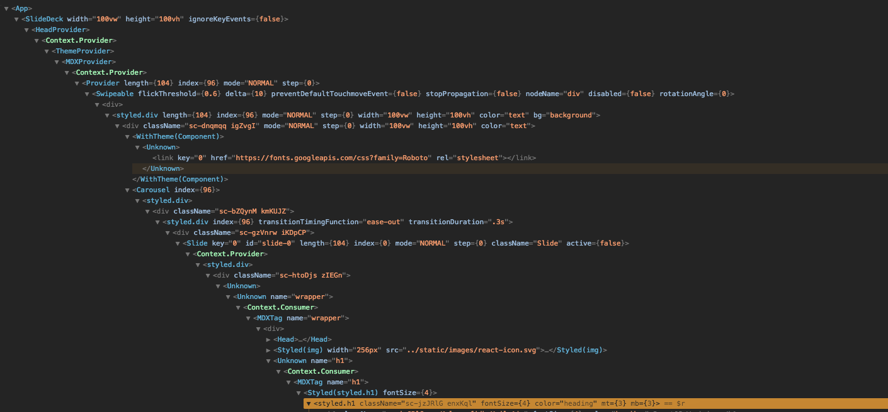

import { Head } from 'gatsby-theme-mdx-deck';
import ReactIcon from './static/images/react-icon.svg';

<Head>
  <title>ReactJS Workshop</title>

  <meta name="viewport" content="width=device-width, initial-scale=1" />
  <link href="https://fonts.googleapis.com/css?family=Montserrat:900|Raleway:400,400i,700,700i&display=swap" rel="stylesheet" />
  <link href="https://afeld.github.io/emoji-css/emoji.css" rel="stylesheet" crossOrigin="anonymous" />
</Head>

# Day 2: Intermediate to Advanced ReactJS

---

<!-- --------------------------------------------------------
|
|  HOCs
|
--------------------------------------------------------- -->

# Higher Order Components

<Div sx={{ fontSize: 5, mt: -4, mb: 6, fontStyle: 'italic' }}>(HOCs)</Div>

---

## Motivation

- Components => primary unit of code reuse
- How to share the state / logic bewteen components?
- So far, we have seen components which convert input data to ouput UIs
- `Higher-order components` transform one component into another

---

<Callout>
  HOCs are functions which accept a component and return another component
</Callout>

```jsx
// Notice the lowercase 'h'
const OutputComponent = higherOrderComponent(InputComponent);
```

<Notes>

- lowercase: HOCs are functions, not a "function that is a component"
- immutable: different component
- Output type same as input type ==> Functional composition
- Never use inside render method: COMPONENT is always different

</Notes>

---

# HOC: What does it look like?

```jsx
function higherOrderComponent(InputComponent) {
  return class extends React.Component {
    // Logic here
    ...

    render() {
      // Add output of logic as props, then add everything else
      return <InputComponent {...this.props} newProp={/* data */} />
    }
  }
}
```

---

```jsx
class CommentList extends React.Component {
  state = { comments: Comments.get() };

  // Event handler
  handleChange = () => {
    this.setState({ comments: Comments.get() });
  };

  // Lifecycle method
  componentDidMount() {
    Comments.subscribe(this.handleChange);
  }

  // Lifecycle method
  componentWillUnmount() {
    Comments.unsubscribe(this.handleChange);
  }

  render() {
    return (
      <div>
        {this.state.comments.map(comment => (
          <Comment comment={comment} key={comment.id} />
        ))}
      </div>
    );
  }
}
```

---

```jsx
class BlogPost extends React.Component {
  state = { blogPost: Blog.getPost(this.props.id) };

  // Event handler
  handleChange = () => {
    this.setState({ blogPost: Blog.getPost(this.props.id) });
  };

  // Lifecycle method
  componentDidMount() {
    Blog.subscribe(this.handleChange);
  }

  // Lifecycle method
  componentWillUnmount() {
    Blog.unsubscribe(this.handleChange);
  }

  render() {
    return <TextBlock text={this.state.blogPost} />;
  }
}
```

---

# Common Logic

```jsx
class Logic extends React.Component {
  state = { data: selectData(this.props) };

  // Event handler
  handleChange = () => {
    this.setState({ data: selectData(this.props) });
  };

  // Lifecycle method
  componentDidMount() {
    DataSource.subscribe(this.handleChange);
  }

  // Lifecycle method
  componentWillUnmount() {
    DataSource.unsubscribe(this.handleChange);
  }
}
```

---

```jsx
function withSubscription(InputComponent, DataSource, selectData) {
  return class extends React.Component {
    state = { data: selectData(this.props) };

    // Event handler
    handleChange = () => {
      this.setState({ data: selectData(this.props) });
    };

    // Lifecycle method
    componentDidMount() {
      DataSource.subscribe(this.handleChange);
    }

    // Lifecycle method
    componentWillUnmount() {
      DataSource.unsubscribe(this.handleChange);
    }

    render() {
      return <InputComponent {...this.props} data={this.state.data} />;
    }
  };
}
```

---

# Cleaner Code!

<Div sx={{ fontSize: 5, mt: -5, mb: 2, fontStyle: 'italic' }}>CommentList</Div>

<!-- prettier-ignore-start -->

```jsx
// "Dumb" component
function CommentList(props) {
  return (
    <div>
      {props.data.map(comment => (
        <Comment comment={comment} key={comment.id} />
      ))}
    </div>
  );
}

// Use the HOC
const CommentListWithSubscription = withSubscription(
  CommentList,
  Comment,
  () =>Comment.get(),
);

export default CommentListWithSubscription;
```

<!-- prettier-ignore-end -->

---

# Cleaner Code!

<Div sx={{ fontSize: 5, mt: -5, mb: 2, fontStyle: 'italic' }}>BlogPost</Div>

<!-- prettier-ignore-start -->

```jsx
// "Dumb" component
function BlogPost(props) {
  return <TextBlock text={props.data} />;
}

// Use the HOC
const BlogPostWithSubscription = withSubscription(
  BlogPost,
  Blog,
  props => Blog.getPost(props.id),
);

export default BlogPostWithSubscription;
```

<!-- prettier-ignore-end -->

---

# Exercise Set #6

<small>HOCs</small>

---

<!-- --------------------------------------------------------
|
|  Render Props
|
--------------------------------------------------------- -->

# Render Props

---

<Callout sx={{ mb: 3 }}>
  A technique for sharing code between React components using a prop whose value
  is a function
</Callout>

An alternative to HOCs for sharing state / logic

---

# A prop that is a function

- The function knows how to render data
- Similar to a normal pure (function) component
- But we have control over what/how data is passed
- i.e. not a `props` object

---

Define a component that calls a render function and passes state/data

```jsx
class DataProvider extends React.Component {
  // logic eventually stored in state
  state = {};

  render() {
    return this.props.render(this.state);
  }
}
```

Now we have transparent control over how data is consumed:

<!-- prettier-ignore-start -->

```jsx
<DataProvider
  render={data => <h1>Hello {data.target}</h1>}
/>
```

<!-- prettier-ignore-end -->

---

# Prop name is arbitray

```jsx
<DataProvider foo={data => <h1>Hello {data.target}</h1>} />
```

```jsx
<DataProvider bar={data => <h1>Hello {data.target}</h1>} />
```

```jsx
<DataProvider children={data => <h1>Hello {data.target}</h1>} />
```

---

# children is special in React

```jsx
<DataProvider>{data => <h1>Hello {data.target}</h1>}</DataProvider>
```

---

# withSubscription HOC

<Div sx={{ fontSize: 5, mt: -5, mb: 2 }}>
  How can we convert this to a Render Prop?
</Div>

```jsx
// from before
function withSubscription(InputComponent, DataSource, selectData) {
  return class extends React.Component {
    state = { data: selectData(props) };

    handleChange = () => {
      this.setState({ data: selectData(props) });
    };
    componentDidMount() {
      DataSource.subscribe(this.handleChange);
    }
    componentWillUnmount() {
      DataSource.unsubscribe(this.handleChange);
    }

    render() {
      return <InputComponent {...this.props} data={this.state.data} />;
    }
  };
}
```

---

# Replace rendering with a function call

```jsx
class WithSubscription extends React.Component {
  // Don't need to pass props back up
  state = { data: this.props.selectData() };

  handleChange = () => {
    this.setState({ data: this.props.selectData() });
  };
  componentDidMount() {
    this.props.dataSource.subscribe(this.handleChange);
  }
  componentWillUnmount() {
    this.props.dataSource.unsubscribe(this.handleChange);
  }

  render() {
    // We now expect children to be a function
    return this.props.children(this.state.data);
  }
}
```

---

# How to use?

<Div sx={{ fontSize: 5, mt: -5, mb: 2, fontStyle: 'italic' }}>BlogPost</Div>

```jsx
function BlogPost(props) {
  // Whatever is returned by this function will be passed to our children function
  const selectDataFn = () => Blog.getPost(props.id);

  return (
    <WithSubscription dataSource={Blog} selectData={selectDataFn}>
      {text => <TextBlock text={text} />}
    </WithSubscription>
  );
}
```

<Notes>

- You have complete control over render prop
- Doesn't have to pass single arg
- Could be multiple
- Could be mixed types

</Notes>

---

# Exercise Set #7

<small>Render Props</small>

---

<!-- --------------------------------------------------------
|
|  Context API
|
--------------------------------------------------------- -->

# Context API

---

# What is it?

<Callout>
  Pass data through the component tree without having to pass props down
  manually at every level
</Callout>

---

# Why is this a problem



---

# API

```js
const MyContext = React.createContext(defaultValue);
```

<Notes>

- `defaultValue` only used if a _Context aware_ component can't find its context broadcaster
- Always good to set props to defaults
- Also useful for testing

</Notes>

---

# API: MyContext.Provider

```jsx
<MyContext.Provider value={/* some value */}>
  {/* Nest JSX DOM tree  */}
</MyContext.Provider>
```

- Broadcastor of the _context data_
- Can be connected to _many_ consumers
- All descendent consumers update with changes _value_

---

# API: MyContext.Consumer

```jsx
<MyContext.Consumer>
  {value => (
    /* render something based on the context value */
  )}
</MyContext.Consumer>
```

- receiver of the _context data_
- Render prop!
- `value` will equal `defaultValue` if no _Provider_ above

---

```jsx
... // create `ThemeContext`
// App component that provides initial context values
function Parent(props) {
  const { signedInUser, theme } = props;

  return (
    <ThemeContext.Provider value={theme}>
      <Layout />
    </ThemeContext.Provider>
  );
}
```

```jsx
// Child of <Layout />, Rendered by <Layout />
function Content() {
  return (
    <ThemeContext.Consumer>
      {theme => (
          <ProfilePage theme={theme} />}
      )}
    </ThemeContext.Consumer>
  );
}
```

---

<Callout>We can share more than 1 context</Callout>

---

```jsx
... // create `ThemeContext` and `UserContext`
// App component that provides initial context values
function Parent(props) {
  const { signedInUser, theme } = props;

  return (
    <ThemeContext.Provider value={theme}>
      <UserContext.Provider value={signedInUser}>
        <Layout />
      </UserContext.Provider>
    </ThemeContext.Provider>
  );
}
```

```jsx
// Child of <Layout />, Rendered by <Layout />
function Content() {
  return (
    <ThemeContext.Consumer>
      {theme => (
        <UserContext.Consumer>
          {user => <ProfilePage user={user} theme={theme} />}
        </UserContext.Consumer>
      )}
    </ThemeContext.Consumer>
  );
}
```

---

# Caution

- Context API can limit a component's reusability
- Try Component composition 1st to solve your prop problem

---

# Exercise Set #8

<small>Context API</small>

<!-- --------------------------------------------------------
|
|  Compound Components
|
--------------------------------------------------------- -->

<!-- # Exercise Set #9
<small>Compound Components</small> -->

---

# Hooks

<Emoji sx={{ fontSize: 8 }} className="em-fishing_pole_and_fish" />

---

## What is a "_hook_"?

- Standard JavaScript functions
- Access React's component lifecycle
- Share stateful logic between components
- Simplify + collocate logic into smaller chunks
- Improved reusability of logic/functionality

> Introduced in React v16.8

<Notes>

- Share logic/state between components without changing component hierarchy
- Logic is no longer spread across multiple Lifecycle methods; they can live together
- They let us ditch `class` components which are confusing to people + minifiers
- They remove component wrapper hell
- They remove the need for render props / HoCs, etc.

</Notes>

---

## Hooks API

- `useState`
- `useEffect`
- `useContext`
- `useReducer`
- `useCallback`
- `useMemo`
- `useRef`
- `useImperativeHandle`
- `useLayoutEffect`
- `useDebugValue`

---

## Hooks API

- `useState`
- `useEffect`
- `useContext`
- ~~`useReducer`~~
- ~~`useCallback`~~
- ~~`useMemo`~~
- ~~`useRef`~~
- ~~`useImperativeHandle`~~
- ~~`useLayoutEffect`~~
- ~~`useDebugValue`~~

---

# `useState`

Set up and manage state

---

```js
import { useState } from 'react';

const [count, setCount] = useState(0);
```

---

```js
const [count, setCount] = useState(0);
```

- **count** - Current value of state (a single number; think `this.state.count`)

- **setCount** - State update function (think: `this.setState()`)

> Note: Using "_array destructuring_" -- `state` and `update function` can be called anything

---

import { useStateClassExample } from './static/snippets/liveCodeExamples';

## Example: Class Component

<ReactLive code={useStateClassExample} />

---

import { useStateFunctionExample } from './static/snippets/liveCodeExamples';

## Example: Hook

<ReactLive code={useStateFunctionExample} />

---

## What if we need more state?

---

import { useStateFunctionExampleMultiState } from './static/snippets/liveCodeExamples';

## Example: Multi-Hook

<ReactLive code={useStateFunctionExampleMultiState} />

---

# `useEffect`

Manage side-effects

<Notes>

Examples:

- Data fetching
- setting up a subscription
- or manually changing the DOM

</Notes>

---

```js
import { useEffect } from 'react';

const [count, setCount] = useEffect(() => {});
```

---

# Rules

- Naming: `use*`
- Only use in: **a)** React function components, or **b)** a custom Hook
- Only call hooks at the top level (not in loops, conditionals, etc)

> see: `eslint-plugin-react-hooks`

---

# /fin

<Div sx={{ fontSize: 8, mt: -5, mb: 4 }}>🎉 🎉 🎉</Div>

<Link to="/">Home</Link>
